#  Techs + Tips 󰛩

#  Techs:
##  Amount:
Some effects like Clash, Masshit, Flames, Black Flash, and Burst on the Visual Block may only display partial visuals when the amount is set below 1. From my testing, a threshold between `0.05` and `0.1` appears to be the safest range.

##  Fingers:
You can show fingers on your moves if you set up your move with the **Ryu's Special** called "Restyle" with the speed of `0`, it'll create fingers until the skill is cancelled. You can also use animations (mostly emotes) that has finger animations, and maybe mix with regular animations, some of them are:

`Sugawara`,
`Heart111`,
`Finger Wag`,
`Yeah!`,
`Nuh Uh!`,
`Unyeah!`,
`Finger Stand`,
`Taunt`,
`Crazy`,
`Mozzarella`,
`Lonely`,
`Jackpot2`,
`Na na boo boo`,
`Perfect`,
`Mourning`

##  Dash Particle:
You can force the dash particles (forward) for **~0.75s** as long as you set up your skill with Higuruma's Pressing Charge with the "Start" of `0.83` and a Sound with Cancel and the ID of [id]91477583246788[/id] as shown on the images below:

[gallery]
assets/images/pressing_charge.webp
assets/images/sound_cancel.webp
[/gallery]
> (And the 5 seconds on End of the Sound Cancel is recommended for performance, Roblox issue.)


## 󰁁 Directional Skill 🚧

##  Omni-Directional Flight 🚧

##  Use Again Skill 🚧

##  Ground detection 🚧

---


# 󰛩 Tips:

##  Screen Color 

The **Screen Color** on the Visual Block applies a fullscreen color effect while also modifying image properties such as saturation and contrast.

- ### Amount:

Controls how **strongly** the color overlay is applied/stacked.

| Value | Preview |
|---|---|
| `1` | 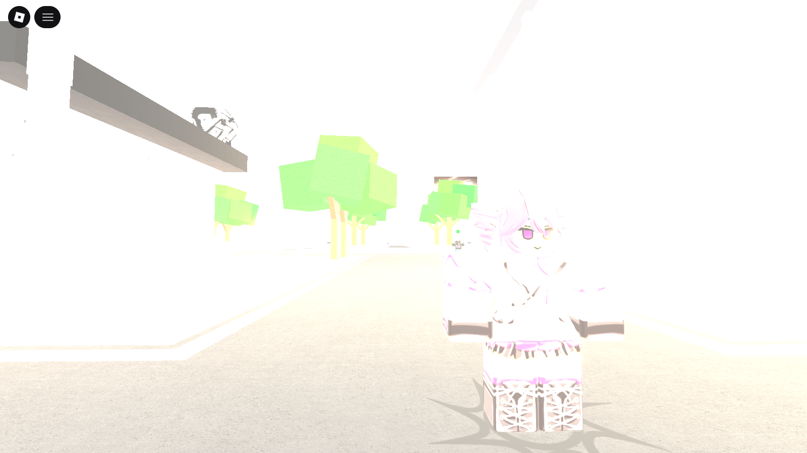 |
| `0.5` | 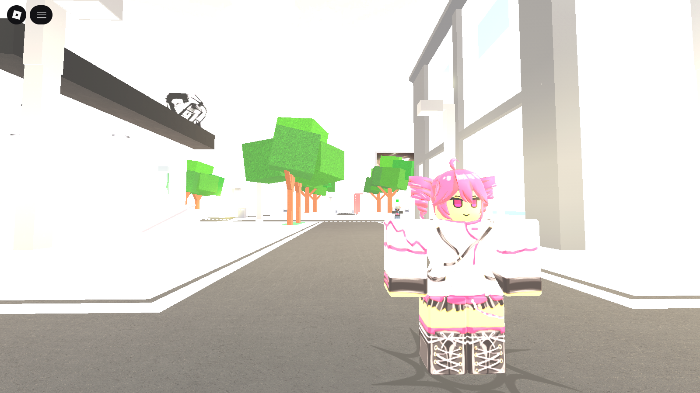 |
| `0` | 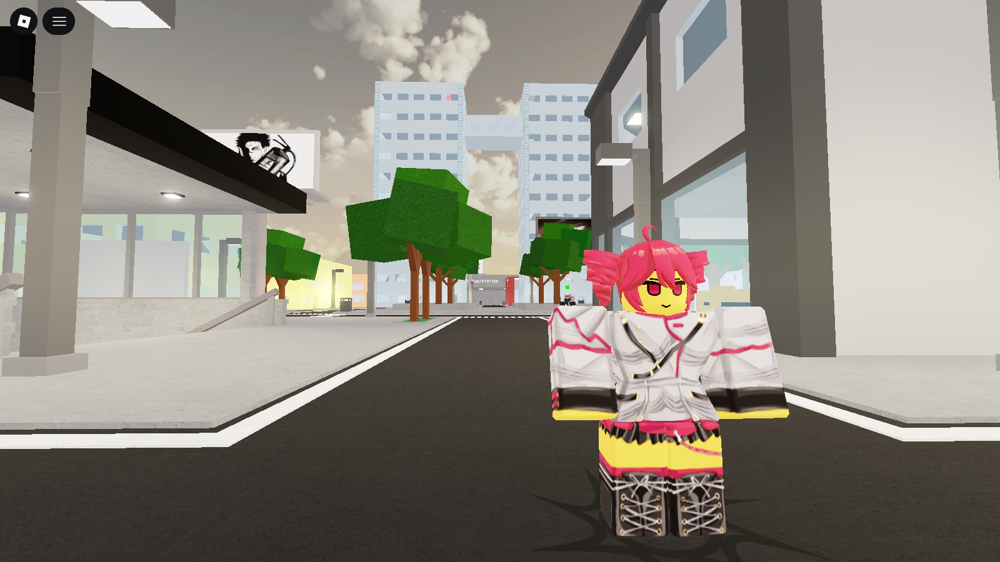 |


- ### Opacity:

The **Opacity** input acts as a **Saturation** control.

| Value | Preview |
|---|---|
| `1` | 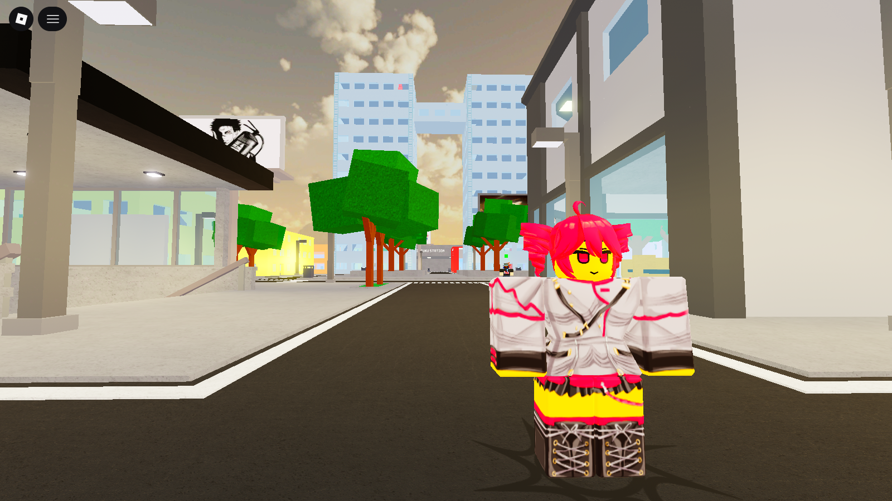 |
| `5` | 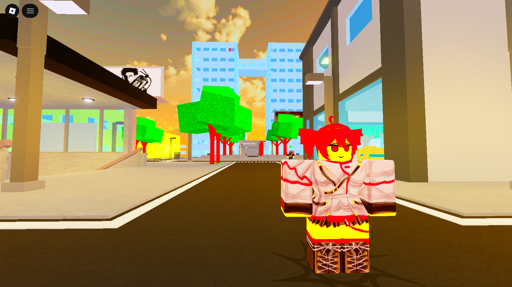 |
| `-1` | 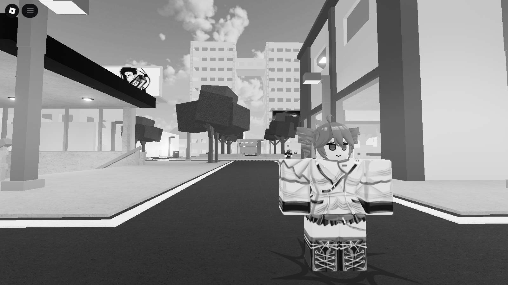 |
| `-5` | 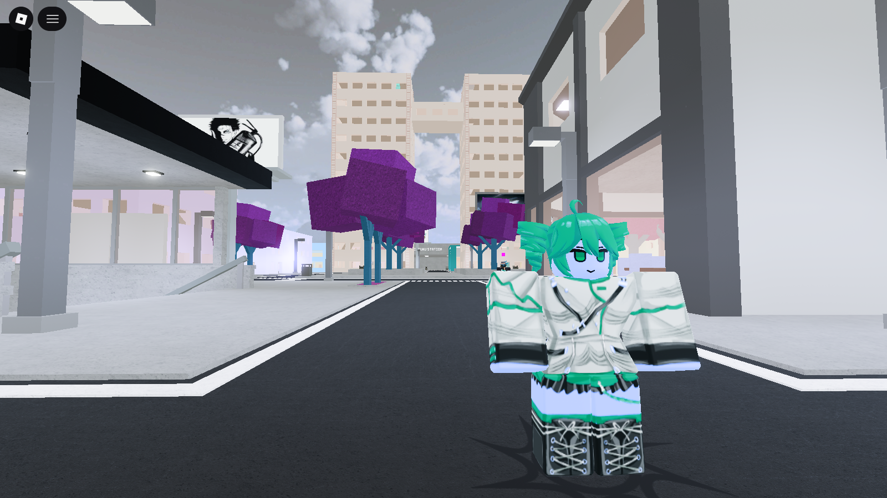 |


- ### Size:

The **Size** input is used for **Contrast** adjustment.

| Value | Preview |
|---|---|
| `1` | 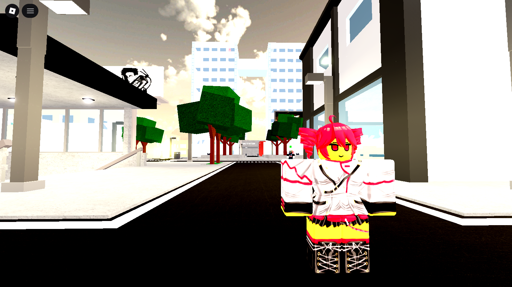 |
| `-1` | 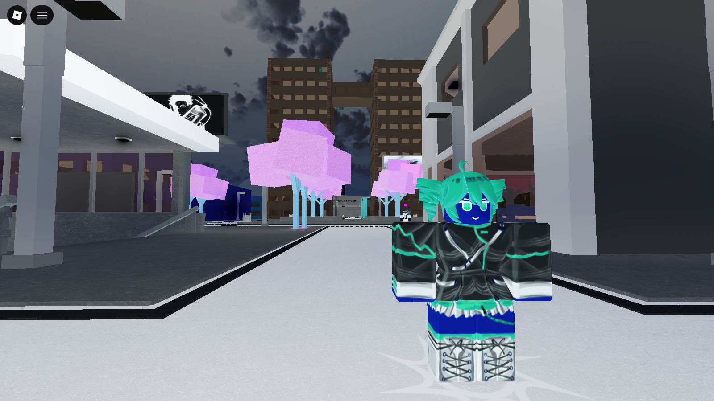 |


### Examples:

- #### Red Screen Overlay

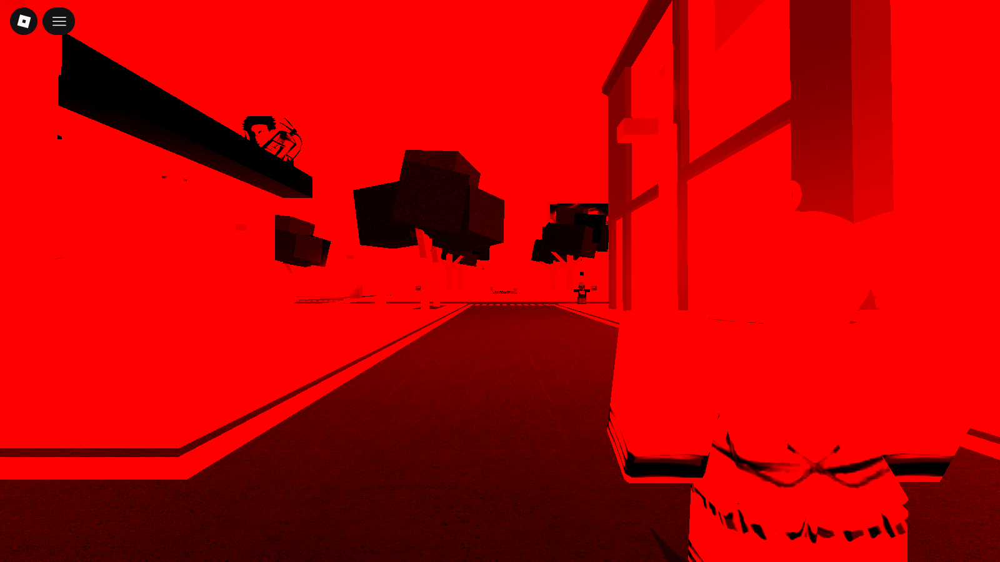

> Amount = `1`  
> Color/Alt = `255, 0, 0`  
> Size = `1`


- #### High Contrast + Desaturation

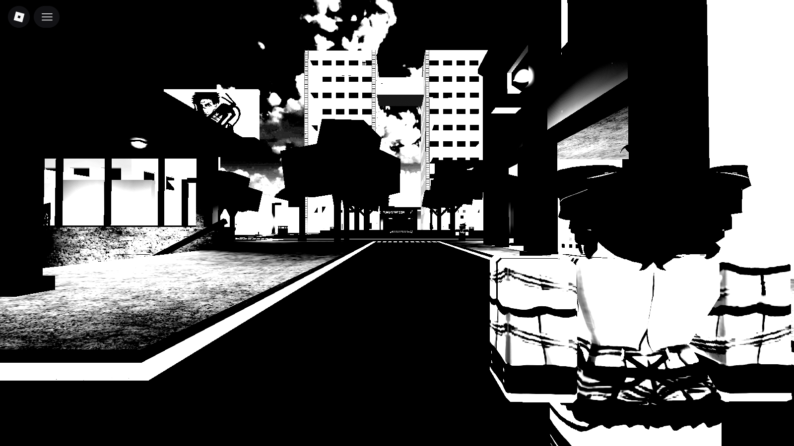

> Opacity = `-1`  
> Size = `22`

---

##  Tags 
Tags work similarly to **Timed Variables**.

If you are familiar with programming, think of them as variables with an expiration timer.  
If not, imagine them as temporary boxes that can store values for a limited time.

Tags allow you to create much more advanced logic than regular Branch Conditions, since they can be:

- Checked
- Set
- Added to
- Removed from
- Expired automatically

---
### Tag
The `"Tag"` property is the name/ID of the tag being referenced.

Example:

```json
Tag: "Mark"
```

---
### Value
The `"Value"` property is the value stored inside the tag.

Depending on the toggles used, this value can:

- Replace the current value
- Be added to it
- Be removed from it

Example:

```json
"Value": 5
```

---
### Time

Defines how long the tag will exist.

Once the timer expires, the tag is deleted and can no longer be checked.

Example:

```json
"Time": 3
```
The tag will exist for 3 seconds.

- ### Removing a Tag

You can effectively remove a tag by setting its time to a very small value:

```json
"Time": 0.001
```


---
### Check
The `"Check"` toggle allows the tag to act as a condition checker instead of modifying values.

To use it:

1. Create another tag block
2. Use the same `"Tag"` name
3. Define the `"Value"` you want to check
4. Enable `"Check"`

If the condition matches, the branch changes to whatever is defined in `"Branch"`.

- ### Comparison Prefixes

You can compare values using prefixes:

| Prefix | Meaning |
|---|---|
| `>` | Higher than |
| `<` | Lower than |

Example:

```json
"Value": ">5"
```

Checks if the tag value is greater than `5`.

---
### Add/Remove
This only works when `"Check"` is disabled.

#### ✔︎ Enabled (`true`)
Adds the `"Value"` to the existing tag value.

#### ✘ Disabled (`false`)
Subtracts the `"Value"` from the existing tag value.

---
### Set
The `"Set"` toggle replaces the previous value entirely.

Example:

Current value:

```json
10
```

New tag:

```json
"Value": 3
"Set": true
```

Result:

```json
3
```

---
### Last Hit
Stores who last applied the hit/stun related to that branch.

Useful for things like:

- Kill credit
- Assist systems
- Counter mechanics
- Target tracking

#### Special Value

| Value | Meaning |
|---|---|
| `-1` | The branch origin / yourself |

## 󰣿 Teleport (1.76 NEW)
The Teleport Block is a block that lets you teleport to position relative to the target.

### Position
Offsets the character from the Last Hit input.
### Rotation
Same for position. It **Rotates** the character relatively from the Last Hit input.
### Last hit
Is who is going to have the previous inputs applied after getting hit/stunned on the last X seconds.
### Projectile Tag
Makes the Chacater to position itself relatively to a projectile's position.
### Relative from branch
Makes the Teleport Node prioritize the origin of the branch instead of the Last Hit target.

---
## 󰖁 Sound Cancel
You can cancel ANY Sound if you place a Sound block with Cancel enabled/true.

---
##  Grab
Grab Block makes the target get attached. You can select with part will grab the target's part with Limb and Target Limb, respectively.
### Position
You can set the position where the target limb will be relatively to the Limb with the `"Position"` input
### Rotation
You can change the rotation of the target's limb towards the input of the `"Rotation"` input
### Time
You can make the be active for and period of time with the `"Time"` input
### Last Hit
The `"Last Hit"` input is for applying to a target that was hit/stunned on the last `X` seconds, but you will mostly use put the value above `0`.
### Grab Damage
Notice that the target will heceive IFrame/Invincibility during the grab block being active. However, you can make the target be able to take damage while being grabbed. For that, you need to place another grab block below it, with a really short time and with another Target's Limb besides the previous Grab limb. Now you can make the target get damage from Hitbox, Projective, Add Health, you name it.

---
## 󰑵 Fix Spinning Camera on Cutscene
For that, place a state block with "Direction Lock" with the duration of the cutscene.